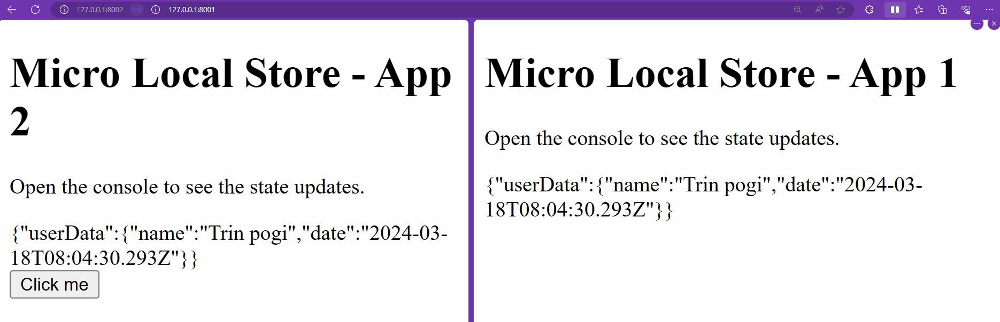

# MicroLocalStore

MicroLocalStore is a lightweight, easy-to-use JavaScript library that provides a shared local storage solution across different origins. It creates an isolated local storage for each instance, allowing you to store and retrieve data seamlessly. It's perfect for micro-frontend architectures, enabling different micro-apps to communicate and share state without conflicts.

With MicroLocalStore, you can easily manage state listeners, send and receive messages between parent and child windows, and more. It's compatible with both browser and Node.js environments.



## Installation

You can install MicroLocalStore using npm:

```bash
npm install micro-local-store
```

After installation, you can import it in your JavaScript file:

```javascript
const MicroLocalStore = require("micro-local-store");
```

Or, if you're using ES6 imports:

```javascript
import MicroLocalStore from "micro-local-store";
```

If you want to use it directly in your HTML file, you can use the unpkg CDN:

```html
<script src="https://unpkg.com/micro-local-store"></script>
```

## Usage

```javascript
const store = new MicroLocalStore("myStore", [
  "https://example.com",
  "https://another-example.com",
]);

// Set state
store.setState({ key: "value" });

// Get state
const state = store.getState();

// Listen for state changes
store.onChange((newState) => {
  console.log(newState);
});

// Stop listening for state changes
store.offChange(listener);
```

## API

### `new MicroLocalStore(id, allowedUrls)`

Creates a new MicroLocalStore instance.

- `id`: A unique identifier for the store.
- `allowedUrls`: An array of URLs that are allowed to share this store's state. These URLs must be allowed by the CORS policy of the server hosting the application.

### `setState(newState)`

Updates the store's state with the provided state object. This will merge the new state with the existing state.

### `getState()`

Returns the current state.

### `onChange(listener)`

Adds a listener function that will be called whenever the state changes.

### `offChange(listener)`

Removes a previously added listener function.

## Cross-Origin Resource Sharing (CORS)

MicroLocalStore uses the postMessage API to communicate between different windows. This requires that the server hosting your application allows the URLs of the other applications to access your application. This is controlled by the server's CORS policy.

When creating a new MicroLocalStore instance, you must provide an array of URLs that are allowed to share the store's state. These URLs must be allowed by the server's CORS policy.

For example, if your application is hosted at `https://example.com` and you want to share state with `https://another-example.com`, your server's CORS policy must allow `https://another-example.com`.

## Express.js CORS Configuration

If you're using Express.js, you can use the `cors` middleware to set up your CORS policy. Here's an example:

```javascript
const express = require("express");
const cors = require("cors");

const app = express();

const corsOptions = {
  origin: ["https://example.com", "https://another-example.com"],
};

app.use(cors(corsOptions));

// Your routes here

app.listen(3000, () => {
  console.log("Server is running on port 3000");
});
```

In this example, `https://example.com` and `https://another-example.com` are allowed to access your application.

## HTML Examples

### App1.html

```html
<!DOCTYPE html>
<html>
  <body>
    <button id="trigger">Trigger State Change</button>
    <div id="state"></div>

    <script src="https://unpkg.com/micro-local-store"></script>
    <script>
      const store = new MicroLocalStore("myStore", [
        "https://example.com/App2.html",
      ]);

      // Get state
      const state = store.getState();
      document.getElementById("state").innerHTML = JSON.stringify(state);

      // Listen for state changes
      store.onChange((newState) => {
        document.getElementById("state").innerHTML = JSON.stringify(newState);
      });

      // Set state on button click
      document.getElementById("trigger").addEventListener("click", () => {
        store.setState({ key: "value from App1" });
      });
    </script>
  </body>
</html>
```

### App2.html

```html
<!DOCTYPE html>
<html>
  <body>
    <button id="trigger">Trigger State Change</button>
    <div id="state"></div>

    <script src="https://unpkg.com/micro-local-store"></script>
    <script>
      const store = new MicroLocalStore("myStore", [
        "https://example.com/App1.html",
      ]);

      // Get state
      const state = store.getState();
      document.getElementById("state").innerHTML = JSON.stringify(state);

      // Listen for state changes
      store.onChange((newState) => {
        document.getElementById("state").innerHTML = JSON.stringify(newState);
      });

      // Set state on button click
      document.getElementById("trigger").addEventListener("click", () => {
        store.setState({ key: "value from App2" });
      });
    </script>
  </body>
</html>
```

## Contributing

Contributions are welcome. Please submit a pull request with any improvements.

## License

This project is licensed under the MIT License.
